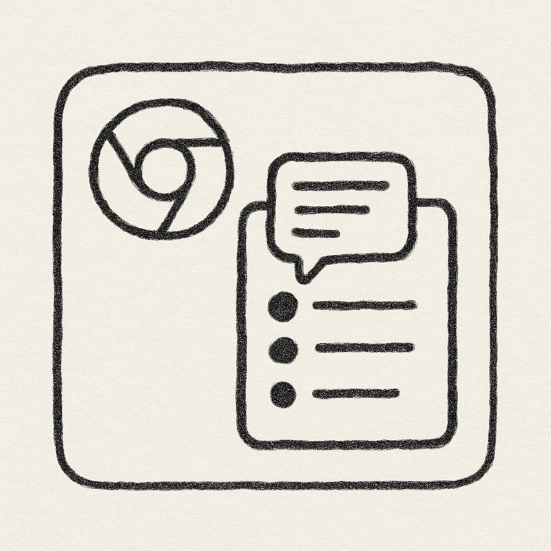

# Gmail AI Reply Assistant

A Chrome extension that uses OpenAI's GPT models to help you write better emails in Gmail.



## Features

- **AI-Powered Email Replies**: Generate complete email responses based on email context and your provided talking points
- **Text Improvement**: Enhance your writing with AI assistance for selected text
- **Keyboard Shortcuts**:
  - `Command+Shift+H` (Mac) / `Ctrl+Shift+H` (Windows/Linux): Generate a complete email reply
  - `Command+Shift+G` (Mac) / `Ctrl+Shift+G` (Windows/Linux): Improve selected text
- **OpenAI Integration**: Uses the latest GPT models for high-quality text generation
- **Custom Prompts**: Configure custom prompts for different use cases
- **Privacy-Focused**: Your API key and data are stored locally in your browser

## Installation

### From Chrome Web Store
*Coming soon*

### Manual Installation
1. Download the latest release from the [Releases page](https://github.com/Wolbyworld/gmail-ai-reply-assistant/releases)
2. Unzip the downloaded file
3. Go to `chrome://extensions/` in your Chrome browser
4. Enable "Developer mode" in the top-right corner
5. Click "Load unpacked" and select the unzipped folder
6. The extension should now be installed and ready to use

## Configuration

1. Click on the extension icon in your Chrome toolbar
2. Select "Options" to open the settings page
3. Enter your OpenAI API key (required to use the extension)
4. Customize prompt templates if desired
5. Save your settings

## Usage

### Generating Email Replies

1. Open Gmail and open an email you want to reply to
2. Press `Command+Shift+H` (Mac) or `Ctrl+Shift+H` (Windows/Linux)
3. Enter the key talking points you want to include in your reply
4. Click "Generate" or press `Command+Enter` (Mac) or `Ctrl+Enter` (Windows/Linux)
5. The AI will generate a reply based on the email context and your talking points
6. The generated text will be automatically inserted into the Gmail compose box

### Improving Selected Text

1. In Gmail, select the text you want to improve
2. Press `Command+Shift+G` (Mac) or `Ctrl+Shift+G` (Windows/Linux)
3. The AI will improve your selected text and replace it with the enhanced version

## Development

### Prerequisites
- Node.js (v14+)
- npm or yarn

### Setup
1. Clone the repository:
   ```
   git clone https://github.com/Wolbyworld/gmail-ai-reply-assistant.git
   cd gmail-ai-reply-assistant
   ```

2. Install dependencies:
   ```
   npm install
   ```

3. Build the extension:
   ```
   ./build.sh
   ```
   This will create a `dist` folder with the built extension and a zip file for distribution.

### Testing
Run the automated tests:
```
npm test
```

## Contributing

Contributions are welcome! Please feel free to submit a Pull Request.

1. Fork the repository
2. Create your feature branch (`git checkout -b feature/amazing-feature`)
3. Commit your changes (`git commit -m 'Add some amazing feature'`)
4. Push to the branch (`git push origin feature/amazing-feature`)
5. Open a Pull Request

## TODO

1. Make it work with Windows PCs

## License

This project is licensed under the ISC License - see the LICENSE file for details.

## Acknowledgments

- OpenAI for providing the GPT API
- All contributors who helped improve this extension

## Privacy Policy

This extension does not collect or transmit any user data except to the OpenAI API for processing your requests. Your OpenAI API key is stored securely in your browser's local storage and is never transmitted to our servers. 